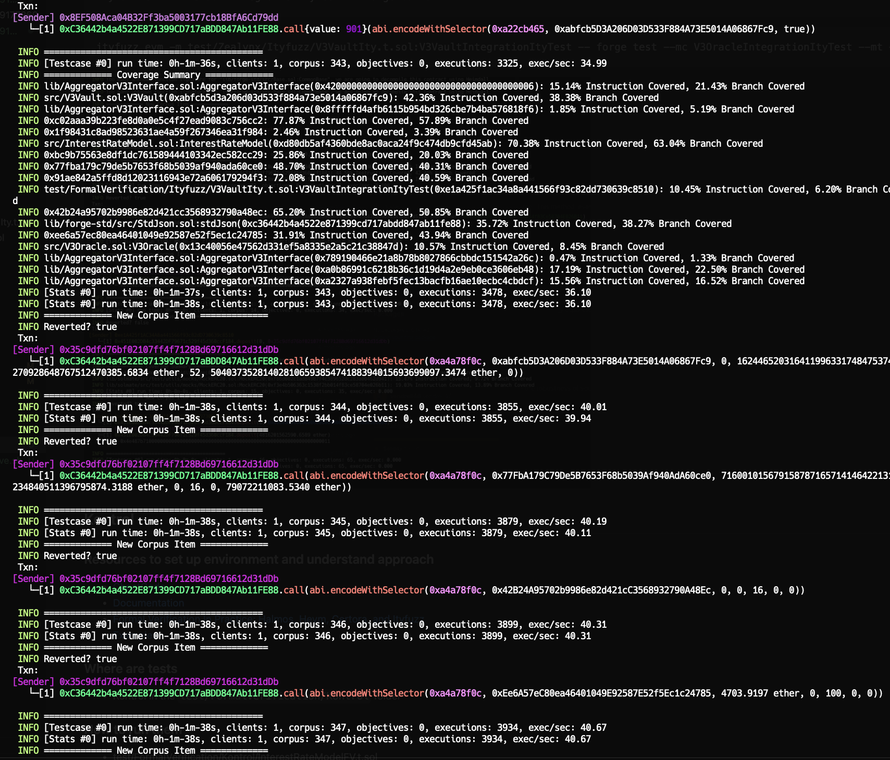
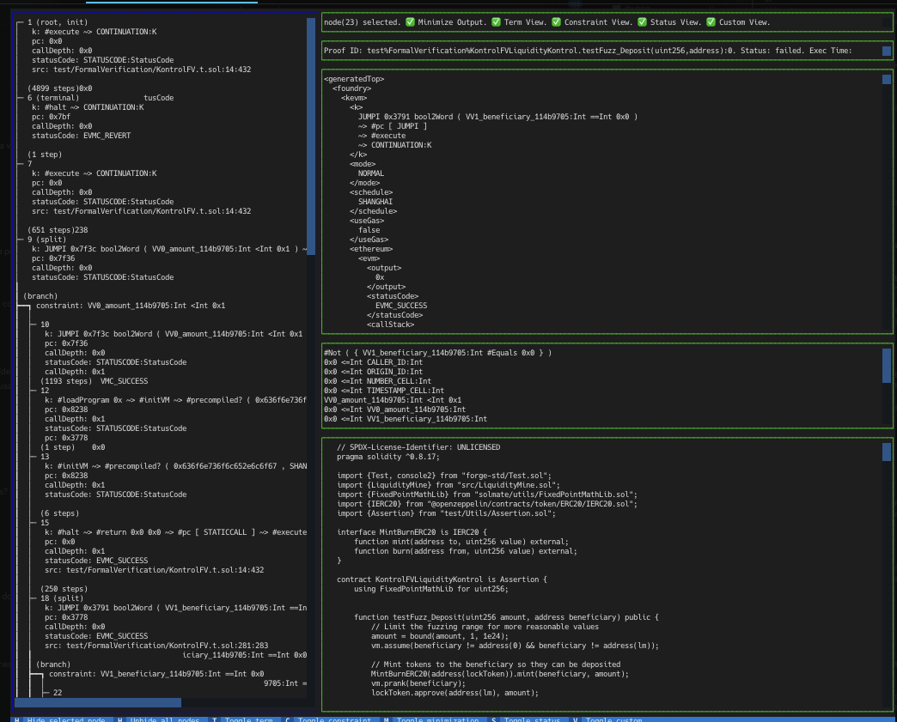

# Complete Documentation of Test Suite Implemented


| Section | Description |
|---------|-------------|
| [Overview](#overview) | Explanation of the reasons for using Kontrol and Ityfuzz, and their respective applications. |
| [Summary](#Summary) | Summary of contract analysis, testing, and formal verification results. |
| [Installation](#installation) | Setup and installation requirements. |
| [Init](#init) | Initial setup and build commands. |
| [Where to Find the Tests](#where-to-find-the-tests) | Locations of different test suites. |
| [Security Test List](#security-test-list) | Comprehensive list of security tests and their details. |
| [Testing Environments](#testing-environments) | Overview of testing environments: Foundry, Echidna, Halmos, Ityfuzz, Medusa, and Kontrol. |
| [Ityfuzz Tests](#ityfuzz) | Details on Ityfuzz testing environment and usage. |
| [Kontrol Tests](#kontrol) | Guide to using Kontrol for test execution and debugging. |


### Overview

---

We have chosen both Kontrol and Ityfuzz tools due to the challenges involved in conducting a comprehensive testing campaign on on-chain contracts. Setting up and implementing tests for this is not yet widely practiced, as it is still in the development phase, and there are no established guidelines for doing it correctly.

Thanks to direct contact with the developers and security auditors of these tools, we have been able to resolve any issues that have arisen during the work.

That said, we would like to show and explain the reasons why one tool was used in some cases and another in others.

In the case of Kontrol, we set up by importing all the contract bytecode, using low-level calls to interact more directly since no formal verification tool allows on-chain execution of tests. Contracts where no tests have been conducted are due to their incompatibility with the tool.

Ityfuzz was used in cases where the Kontrol tool could not reach due to its limitations. Ityfuzz is a semi-automatic tool that runs on top of tools like Echidna and Foundry, among others, capable of combining Foundry's fuzzer with formal verification (concolic execution) assisted fuzzing algorithms guided by dataflow patterns and comparisons.

Ityfuzz can be run in various ways as we have indicated in the usage instructions, with direct references to examples and documentation.

In summary, we would like to emphasize the enormous complexity and difficulty of performing Formal Verification tests on such a large project with so many on-chain dependencies.

Please contact us if you have any questions about the project, tool, or need assistance in implementing new configurations.

---


### Summary

---

The contracts AutoExit, AutoRange, V3Utils, InterestRateModelFV, AutoCompound, V3Oracle, and V3Vault have been analyzed. Various tests have been written to verify the integrity and security of the invariants specified in each contract.

We have thoroughly analyzed and tested each of the protocol's invariants. After an in-depth analysis, we have confirmed through Formal Verification that the invariants hold true, ensuring that the protocol has a strong and secure foundation.

---


## Installation

To be able to use this repository, you need to have the following installed:

- [Kontrol](https://github.com/runtimeverification/kontrol/tree/master)
- [Ityfuzz](https://github.com/fuzzland/ityfuzz)


## Init:

```js
 git submodule update --init --recursive
```
```js
sudo forge build -force
```
### You can find more information on this repository:
- [Example implementation 1](https://github.com/ZealynxSecurity/Zealynx/blob/main/OurWork/Fuzzing-and-Formal-Verification/public-contests/Olas%20Protocol/Readme-Olas.md)
- [Example implementation 2](https://github.com/ZealynxSecurity/BastionWallet)
- [Example implementation 3](https://github.com/ZealynxSecurity/Portals-local/tree/main)
- [Example implementation 4](https://github.com/ZealynxSecurity/Token_glifio/tree/main)

## Where to find the tests

You can find the tests in various folders:

- Kontrol in the `test/FormalVerification/Kontrol` folder
- Ityfuzz in the `test/FormalVerification/Ityfuzz` folder

# Security Test List


| Number | Contract             | Test Name                                       | Tool Used |
|--------|----------------------|-------------------------------------------------|-----------|
| 1      | AutoExit             | testFuzzDirectSendNFT                           | Kontrol   |
| 2      | AutoExit             | testFuzzSetTWAPSeconds                          | Kontrol   |
| 3      | AutoExit             | testFuzzSetMaxTWAPTickDifference                | Kontrol   |
| 4      | AutoExit             | testFuzzSetOperator                             | Kontrol   |
| 5      | AutoExit             | testFuzzRunWithoutConfig                        | Kontrol   |
| 6      | AutoRange            | testFuzzAdjustWithoutConfig                     | Kontrol   |
| 7      | AutoRange            | testFuzzAdjustNotAdjustable                     | Kontrol   |
| 8      | AutoRange            | testFuzzAdjustOutOfRange                        | Kontrol   |
| 9      | AutoRange            | testFuzzAdjustWithTooLargeSwap                  | Kontrol   |
| 10     | AutoRange            | testFuzzOracleCheck                             | Kontrol   |
| 11     | V3Utils              | testFuzz_UnauthorizedTransfer                   | Kontrol   |
| 12     | V3Utils              | testFuzz_UnauthorizedTransferParam              | Kontrol   |
| 13     | V3Utils              | testFuzzInvalidInstructions                     | Kontrol   |
| 14     | V3Utils              | testFuzzSendEtherNotAllowed                     | Kontrol   |
| 15     | V3Utils              | testFuzzFailEmptySwapAndIncreaseLiquidity       | Kontrol   |
| 16     | InterestRateModelFV  | testFuzzUtilizationRates                        | Kontrol   |
| 17     | InterestRateModelFV  | testFuzzInterestRates                           | Kontrol   |
| 18     | InterestRateModelFV  | testFuzzZeroCashAndDebt                         | Kontrol   |
| 19     | InterestRateModelFV  | testFuzzMonotonicity                            | Kontrol   |
| 20     | InterestRateModelFV  | testFuzzProportionality                         | Kontrol   |
| 21     | InterestRateModelFV  | testFuzzGetRatesPerSecondX64                    | Kontrol   |
| 22     | InterestRateModelFV  | testFuzzBasicInvariants                         | Kontrol   |
| 23     | InterestRateModelFV  | testFuzzZeroDebt                                | Kontrol   |
| 24     | InterestRateModelFV  | testFuzzZeroCashAndDebt                         | Kontrol   |
| 25     | InterestRateModelFV  | testFuzzUtilizationAtKink                       | Kontrol   |
| 26     | InterestRateModelFV  | testFuzzUtilizationAboveKink                    | Kontrol   |
| 27     | InterestRateModelFV  | testFuzzSetValuesOnlyOwner                      | Kontrol   |
| 28     | InterestRateModelFV  | testFuzzxSetValues                              | Kontrol   |
| 29     | InterestRateModelFV  | testFuzzSetValuesInvalidConfig                  | Kontrol   |
| 30     | InterestRateModelFV  | testFuzzSetValuesZeroRates                      | Kontrol   |
| 31     | AutoCompound         | testFuzzWithdrawLeftover                        | Ityfuzz   |
| 32     | AutoCompound         | testFuzzExecuteWithVariousAmountIn              | Ityfuzz   |
| 33     | AutoCompound         | testFuzzExecuteWithDifferentDeadlines           | Ityfuzz   |
| 34     | AutoCompound         | testFuzzExecuteVariousAmountIn                  | Ityfuzz   |
| 35     | AutoCompound         | testFuzzTWAPVerificationWithDifferentAmountIn   | Ityfuzz   |
| 36     | AutoCompound         | testFuzzTWAPVerification                        | Ityfuzz   |
| 37     | AutoCompound         | testFuzzHandlingOfErrors                        | Ityfuzz   |
| 38     | V3Oracle             | testFuzzGetValuePricesAndAmounts                | Ityfuzz   |
| 39     | V3Oracle             | testFuzzGetValueWithConfiguredTokens            | Ityfuzz   |
| 40     | V3Oracle             | testFuzzGetLiquidityAndFees                     | Ityfuzz   |
| 41     | V3Oracle             | testNormalOperation                             | Ityfuzz   |
| 42     | V3Oracle             | testTWAPManipulation                            | Ityfuzz   |
| 43     | V3Oracle             | testFuzzOracleManipulation                      | Ityfuzz   |
| 44     | V3Oracle             | testResilienceToManipulation                    | Ityfuzz   |
| 45     | V3Vault              | testDepositLimits                               | Ityfuzz   |
| 46     | V3Vault              | testDepositWithAssertions                       | Ityfuzz   |
| 47     | V3Vault              | testMintLimits                                  | Ityfuzz   |
| 48     | V3Vault              | testFuzzCollateralValueLimit                    | Ityfuzz   |
| 49     | V3Vault              | testFuzzFreeLiquidation                         | Ityfuzz   |


# Testing Environments


## Ityfuzz

### Resources to set up environment and understand approach

- [GitHub](https://github.com/fuzzland/ityfuzz/tree/master)
- [Documentation](https://docs.ityfuzz.rs/)
- [Formal Verification In Practice: Halmos, Hevm, Certora, and Ityfuzz](https://allthingsfuzzy.substack.com/p/formal-verification-in-practice-halmos?r=1860oo&utm_campaign=post&utm_medium=web)
- [Examples](https://github.com/a16z/halmos/tree/main/examples)
- [Video examples](https://mirror.xyz/0x44bdEeB120E0fCfC40fad73883C8f4D60Dfd5A73/IQgirpcecGOqfWRozQ0vd8e5mLLjWfX5Pif2Fbynu6c)

### Where are tests

- Ityfuzz in the `test/FormalVerification/Ityfuzz` folder

### How to run them

We can run ityfuzz in two main ways:

1. Running ityfuzz on Invariant Tests
Use ityfuzz to run on top of the invariant tests you have already written. This method leverages the existing invariant checks in your tests.

2. [Using Inline Assertions with ityfuzz](https://github.com/fuzzland/ityfuzz/blob/master/solidity_utils/lib.sol)

To use [inline assertions with ityfuzz](https://github.com/fuzzland/ityfuzz/blob/960e9e148d376615df776529ddaedba93af0dced/tests/evm/complex-condition/test.sol), follow these steps:

Step 1: Incorporate the solidity_utils library into your contract (LiquidityMine.sol):

```solidity
import "lib/solidity_utils/lib.sol";
```

Step 2: Add the cheat code bug() at the points in your code where you want to verify an invariant.

In each setup, there's a section written as:
```targetContract(<contract>);```

- This is used so that when you run ityfuzz, it analyzes each contract both individually and collectively. 
- You can comment it out if you prefer to focus only on the written tests.

#### AutoCompound.sol

- test/FormalVerification/Ityfuzz/AutoCompoundIty.t.sol


```solidity
ityfuzz evm -m AutoCompoundItyTest -- forge build
```
```solidity
ityfuzz evm -m test/Zealynx/Ityfuzz/AutoCompoundIty.t.sol:AutoCompoundItyTest -- forge build --mc AutoCompoundItyTest --mt <test>
```

#### V3Oracle.sol

- test/FormalVerification/Ityfuzz/V3Oracleity.t.sol

```solidity
ityfuzz evm -m V3OracleIntegrationItyTest -- forge build
```
```solidity
ityfuzz evm -m test/Zealynx/Ityfuzz/V3Oracleity.t.sol:V3OracleIntegrationItyTest -- forge test --mc V3OracleIntegrationItyTest --mt <test>
```


#### V3Vault.sol

- test/FormalVerification/Ityfuzz/V3VaultIty.t.sol
  
```solidity
ityfuzz evm -m V3VaultIntegrationItyTest -- forge build
```
```solidity
ityfuzz evm -m test/Zealynx/Ityfuzz/V3VaultIty.t.sol:V3VaultIntegrationItyTest -- forge test --mc V3OracleIntegrationItyTest --mt <test>
```





## Kontrol

### Resources to set up environment and understand approach

- [CheatCode](https://github.com/runtimeverification/kontrol-cheatcodes/tree/master)
- [Documentation](https://docs.runtimeverification.com/kontrol)
- [Formal Verification In Practice: Halmos, Hevm, Certora, and Ityfuzz](https://allthingsfuzzy.substack.com/p/formal-verification-in-practice-halmos?r=1860oo&utm_campaign=post&utm_medium=web)
- [Examples](https://github.com/runtimeverification/kontrol-demo)

### Where are tests

- Kontrol in the `test/FormalVerification/Kontrol` folder
### How to run them

- test/FormalVerification/Kontrol/InterestRateModelFV.t.sol
- test/FormalVerification/Kontrol/V3UtilsK.t.sol
- test/FormalVerification/Kontrol/AutoRangeK.t.sol
- test/FormalVerification/Kontrol/AutoExitK.t.sol
  

To use **Kontrol** effectively, follow these steps:


Step 1: Recompile Your Project

In most cases, you need to recompile your project:
```bash
forge build --force
```

Step 2: Compile Kontrol

Next, compile Kontrol:
```bash
kontrol build
```

Step 3: Execute Tests

You can execute your tests in several ways. Here is a clear method using the command:

#### InterestRateModel
```bash
kontrol prove --match-test InterestRateModelFV.<test> --max-depth 10000 --no-break-on-calls --max-frontier-parallel 2 --verbose
```

#### V3Utils

```bash
kontrol prove --match-test V3UtilsKTest.<test> --max-depth 10000 --no-break-on-calls --max-frontier-parallel 2 --verbose
```

#### AutoRange

```bash
kontrol prove --match-test AutoRangeKTest.<test> --max-depth 10000 --no-break-on-calls --max-frontier-parallel 2 --verbose
```

#### AutoExit

```bash
kontrol prove --match-test AutoExitKTest.<test> --max-depth 10000 --no-break-on-calls --max-frontier-parallel 2 --verbose
```

Step 4: [Investigate Test Failures](https://docs.runtimeverification.com/kontrol/guides/kontrol-example/k-control-flow-graph-kcfg)

If you want to delve deeper into a test to understand why it failed, you can use the following commands for a detailed breakdown of the interaction:

```bash
kontrol view-kcfg '<contract>.<test>(<data>)' --version <specify version>
```
or
```bash
kontrol view-kcfg <contract>.<test>
```
or
```bash
kontrol show <contract>.<test>
```




